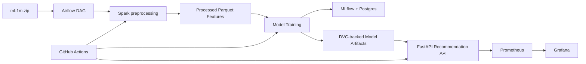

# Movie Recommender Team37

MLOps pipeline for a MovieLens 1M recommendation system. The project uses Airflow for orchestration, Spark for data processing, MLflow for experiment tracking, DVC for artifact versioning, FastAPI for model serving, Docker for deployment, Prometheus/Grafana for monitoring, and GitHub Actions for CI/CD.

## Architecture



## Folder Structure

```text
api/                    FastAPI application
configs/                Runtime and pipeline settings
dags/                   Airflow DAGs
docker/                 Docker, Prometheus, Grafana, and Airflow support files
docs/                   Deployment notes
k8s/                    Local kind manifests for API and monitoring
scripts/                Utility scripts for CI/sample runs
src/movie_recommender/  Data, training, serving, monitoring package
tests/                  Unit and API tests
data/                   Generated raw/interim/processed data, ignored by Git
models/                 Generated model artifacts, ignored by Git
artifacts/              Metrics and MLflow artifacts, ignored by Git
```

## Branch Workflow

Use component branches and squash PRs into `main`.

Planned branch sequence:

1. `da25m537/feature/mlpipeline`
2. `da25m537/model-training`
3. `da25m537/model-versioning`
4. `da25m537/api-deployment`
5. `da25m537/monitoring`
6. `da25m537/docker-compose-stack`
7. `da25m537/k8s-api-monitoring`
8. `da25m537/cicd-docs`
9. `da25m537/aws-ec2-deployment`

## Setup

```bash
python -m venv .venv
source .venv/bin/activate
pip install -r requirements-dev.txt
```

The dataset zip `ml-1m.zip` is kept in the repository as requested. Generated extracted data, processed data, and model artifacts are ignored by Git and should be tracked with DVC.

## Run The Pipeline Locally

```bash
make extract
make preprocess
make train
```

For a faster deterministic sample run:

```bash
python scripts/run_sample_pipeline.py
```

Outputs:

- `data/raw/ml-1m/`
- `data/processed/`
- `models/recommendations.parquet`
- `models/popular_movies.parquet`
- `models/als_model/`
- `artifacts/metrics.json`

## Airflow

Start the local stack:

```bash
cp .env.example .env
docker compose up --build
```

Airflow UI:

- URL: `http://localhost:8080`
- Username: `admin`
- Password: `admin`

The DAG is `movie_recommender_pipeline` and runs extract, Spark preprocessing, and model training. It is manual by default. Set `MOVIE_RECOMMENDER_DAG_SCHEDULE` if a scheduled run is needed.

## MLflow

MLflow runs at:

```text
http://localhost:5000
```

The Compose stack uses a shared Postgres service with a separate `mlflow` database.

## DVC

Initialize DVC and track generated artifacts:

```bash
dvc init
dvc repro
dvc add data/raw/ml-1m data/processed models
git add dvc.yaml params.yaml .dvc .gitignore
```

Local remote example:

```bash
mkdir -p ../movie-recommender-dvc
dvc remote add -d localremote ../movie-recommender-dvc
dvc push
```

Future S3 remote:

```bash
dvc remote add -d aws-s3 s3://replace-with-your-bucket/dvc
dvc push
```

## API

Run locally after training:

```bash
make api
```

Endpoints:

```bash
curl http://localhost:8000/health
curl http://localhost:8000/ready
curl "http://localhost:8000/recommendations/1?k=10"
curl http://localhost:8000/metrics
```

Unknown users fall back to the popularity baseline.

Example response:

```json
{
  "user_id": 1,
  "k": 10,
  "fallback": false,
  "recommendations": [
    {
      "movie_id": 1,
      "title": "Toy Story",
      "genres": "Animation|Children's|Comedy",
      "score": 4.9,
      "rank": 1,
      "release_year": 1995
    }
  ]
}
```

## Docker

```bash
docker compose up --build
docker compose down
```

Service URLs:

- FastAPI: `http://localhost:8000`
- Airflow: `http://localhost:8080`
- MLflow: `http://localhost:5000`
- Prometheus: `http://localhost:9090`
- Grafana: `http://localhost:3000`

Grafana credentials:

- Username: `admin`
- Password: `admin`

Optional Spark standalone containers:

```bash
docker compose -f docker-compose.yml -f docker-compose.spark.yml up --build
```

## Monitoring

The API exposes Prometheus metrics at `/metrics`.

Tracked metrics include:

- API request count
- API latency
- prediction count
- fallback prediction count

Grafana provisions a dashboard from `docker/grafana/dashboards/api-dashboard.json`.

## CI/CD

GitHub Actions includes:

- linting
- unit tests
- Airflow DAG syntax validation
- deterministic sample pipeline
- Docker image build
- uploaded metrics artifact

The manual workflow `Full MovieLens Pipeline` runs the full dataset pipeline and uploads model artifacts.

## Kubernetes

Kubernetes support is limited to local `kind` deployment for API and monitoring.

```bash
kind create cluster --name movie-recommender
docker build -t movie-recommender-team37:local .
kind load docker-image movie-recommender-team37:local --name movie-recommender
kubectl apply -f k8s/
kubectl port-forward svc/movie-recommender-api 8000:8000
kubectl port-forward svc/grafana 3000:3000
```

Airflow, Spark, MLflow, and Postgres remain Docker Compose-first.

## AWS EC2 Demo

AWS hosting is documented in [docs/aws-ec2-deployment.md](docs/aws-ec2-deployment.md). The recommended free-tier strict approach is one small EC2 instance running Docker Compose, with AWS Budgets configured before deployment and the instance stopped when not in use.

## Development Checks

```bash
make lint
make test
python -m py_compile dags/movie_recommender_pipeline.py
```
