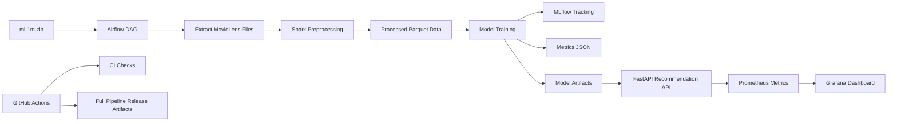

# Movie Recommender Team37

## Project Overview

This repository implements an MLOps pipeline for a MovieLens 1M recommendation
system. It covers data extraction, Spark preprocessing, model training,
experiment tracking, model artifact generation, API serving, Dockerized local
deployment, monitoring, and CI/CD.

The project uses:

- Apache Airflow for workflow orchestration
- Apache Spark for distributed-style data preprocessing
- MLflow for experiment tracking
- DVC for dataset and model artifact versioning
- FastAPI for recommendation serving
- Docker Compose for local services
- Prometheus and Grafana for monitoring
- GitHub Actions for CI/CD and release artifact publishing

The source dataset is expected at:

```text
ml-1m.zip
```

Generated data, model artifacts, metrics, and MLflow files are ignored by Git and
should be tracked through DVC or release artifacts when needed.

## System Architecture

The system is batch-training plus online-serving:

1. Airflow triggers the pipeline.
2. The extraction step unpacks MovieLens data.
3. Spark cleans, joins, preprocesses, and splits the data.
4. Training compares baseline/popularity and ALS recommendation behavior.
5. MLflow records experiment parameters, metrics, and artifacts.
6. Model outputs are written under `models/`.
7. FastAPI loads recommendation artifacts and serves predictions.
8. Prometheus scrapes API metrics.
9. Grafana visualizes API, prediction, and drift signals.
10. GitHub Actions validates code and can publish model artifacts/releases.

## System Architecture Diagram



## Folder Structure

```text
api/                    FastAPI application entrypoint
artifacts/              Generated metrics and MLflow artifacts, ignored by Git
configs/                Runtime and pipeline configuration
dags/                   Airflow DAG definitions
data/                   Generated raw/interim/processed data, ignored by Git
docker/                 Docker, Prometheus, Grafana, and Airflow support files
docs/                   Technical documentation and runbooks
k8s/                    Local kind manifests for API and monitoring
models/                 Generated model artifacts, ignored by Git
scripts/                Utility scripts for CI and sample runs
src/movie_recommender/  Data, model, serving, and monitoring Python package
tests/                  Unit and API tests
```

Important generated outputs:

```text
data/raw/ml-1m/
data/processed/
models/recommendations.parquet
models/popular_movies.parquet
models/als_model/
artifacts/metrics.json
mlruns/
```

## Dependencies

Runtime dependencies are listed in:

```text
requirements.txt
```

Development and test dependencies are listed in:

```text
requirements-dev.txt
```

Core dependencies include:

- `fastapi`, `uvicorn` for API serving
- `pyspark` for data preprocessing and ALS training
- `mlflow` for experiment tracking
- `pandas`, `pyarrow`, `numpy` for artifact loading and local processing
- `prometheus-client` for API metrics
- `dvc[s3]` for data/model versioning
- `pytest`, `ruff` for testing and linting

System dependencies:

- Python 3.11 or compatible environment
- Java 17 for Spark
- Docker and Docker Compose for local services

## Setup And Installation

Create and activate a virtual environment:

```bash
python -m venv .venv
source .venv/bin/activate
```

Install dependencies:

```bash
pip install -r requirements-dev.txt
pip install -e .
```

For shells where `source` is not available, activate the environment with the
shell-specific command for your shell.

## Run Pipelines

Run the full local pipeline:

```bash
make extract
make preprocess
make train
```

Run a faster deterministic sample pipeline:

```bash
python scripts/run_sample_pipeline.py
```

Run the Airflow-orchestrated pipeline:

```bash
cp .env.example .env
docker compose up --build
```

Open Airflow:

```text
http://localhost:8082
```

Credentials:

```text
admin / admin
```

Trigger the DAG:

```text
movie_recommender_pipeline
```

The DAG runs extraction, Spark preprocessing, and model training.

## Run Services

Start all local services:

```bash
cp .env.example .env
docker compose up --build
```

Stop services:

```bash
docker compose down
```

Stop services and remove volumes:

```bash
docker compose down -v
```

Service URLs:

```text
FastAPI:    http://localhost:8000
Swagger:    http://localhost:8000/docs
Airflow:    http://localhost:8082
MLflow:     http://localhost:5000
Prometheus: http://localhost:9090
Grafana:    http://localhost:3000
```

Grafana credentials:

```text
admin / admin
```

Optional Spark standalone containers:

```bash
docker compose -f docker-compose.yml -f docker-compose.spark.yml up --build
```

## API Usage

Run the API locally after training:

```bash
make api
```

Swagger UI:

```text
http://localhost:8000/docs
```

OpenAPI schema:

```text
http://localhost:8000/openapi.json
```

Health checks:

```bash
curl http://localhost:8000/health
curl http://localhost:8000/ready
```

Get recommendations:

```bash
curl "http://localhost:8000/recommendations/1?k=10"
```

Prometheus metrics:

```bash
curl http://localhost:8000/metrics
```

Unknown users fall back to the popularity baseline.

Example response:

```json
{
  "user_id": 1,
  "k": 10,
  "fallback": false,
  "recommendations": [
    {
      "movie_id": 1,
      "title": "Toy Story",
      "genres": "Animation|Children's|Comedy",
      "score": 4.9,
      "rank": 1,
      "release_year": 1995
    }
  ]
}
```

## Docker Execution Commands

Build the API image:

```bash
docker build -t movie-recommender-team37:local .
```

Run the full Compose stack:

```bash
docker compose up --build
```

Run in detached mode:

```bash
docker compose up --build -d
```

View logs:

```bash
docker compose logs -f api
docker compose logs -f airflow-webserver
```

Restart the API after retraining:

```bash
docker compose restart api
```

Shut down:

```bash
docker compose down
```

Remove local service volumes:

```bash
docker compose down -v
```

## MLflow

MLflow is used for experiment tracking.

Local UI:

```text
http://localhost:5000
```

The Docker Compose stack runs MLflow with Postgres as the backend store and
stores artifacts under the project-mounted `artifacts/` directory.

## DVC

DVC is used for dataset and model artifact versioning.

Initialize DVC and run the pipeline:

```bash
dvc init
dvc repro
```

Track generated artifacts:

```bash
dvc add data/raw/ml-1m data/processed models
git add dvc.yaml dvc.lock params.yaml .dvc .gitignore
```

Local remote example:

```bash
mkdir -p ../movie-recommender-dvc
dvc remote add -d localremote ../movie-recommender-dvc
dvc push
```

Future S3 remote example:

```bash
dvc remote add -d aws-s3 s3://replace-with-your-bucket/dvc
dvc push
```

## Monitoring

The API exposes Prometheus metrics at:

```text
http://localhost:8000/metrics
```

Prometheus scrapes the API using:

```text
docker/prometheus.yml
```

Grafana provisions the dashboard from:

```text
docker/grafana/dashboards/api-dashboard.json
```

Dashboard URL:

```text
http://localhost:3000/d/efvbt8hwrwruoe/basic-api-service-dashboard
```

Tracked monitoring areas:

- API request rate
- API latency
- prediction request rate
- fallback ratio
- recommendation item throughput
- recommendation score distribution
- release-year mix as a lightweight drift signal

Detailed metric documentation:

```text
docs/monitoring-metrics.md
```

## CI/CD

GitHub Actions includes:

- linting
- unit tests
- Airflow DAG syntax validation
- deterministic sample pipeline
- Docker image build
- metrics artifact upload

The full pipeline workflow can run the complete MovieLens pipeline and upload
model artifacts. The release workflow branch also supports creating branch-based
release artifacts for `test` and `main`.

## Model Development

Guidance for adding a new model and comparing metrics is documented in:

```text
docs/model-development-faq.md
```

Short workflow:

```bash
git checkout main
git pull
git checkout -b <username>/model-<model-name>
make extract
make preprocess
make train
cat artifacts/metrics.json
```

Before opening a PR:

```bash
ruff check src api dags tests scripts
pytest -q
python -m py_compile dags/movie_recommender_pipeline.py
python scripts/run_sample_pipeline.py
```

## Kubernetes

Kubernetes support is limited to local `kind` deployment for API and monitoring.

```bash
kind create cluster --name movie-recommender
docker build -t movie-recommender-team37:local .
kind load docker-image movie-recommender-team37:local --name movie-recommender
kubectl apply -f k8s/
kubectl port-forward svc/movie-recommender-api 8000:8000
kubectl port-forward svc/grafana 3000:3000
```

Airflow, Spark, MLflow, and Postgres remain Docker Compose-first.

## AWS EC2 Demo

AWS hosting notes are documented in:

```text
docs/aws-ec2-deployment.md
```

For strict free-tier usage, use one small EC2 instance running Docker Compose,
configure AWS Budgets before deployment, and stop or terminate resources when
not in use.

## Technical Report

The full technical report is available in:

```text
docs/technical-report.md
```

It covers the problem statement, dataset description, system architecture, data
pipeline, model development, deployment strategy, monitoring strategy, CI/CD
implementation, results and discussion, challenges faced, and future
improvements.

## Development Checks

```bash
make lint
make test
python -m py_compile dags/movie_recommender_pipeline.py
python scripts/run_sample_pipeline.py
```
